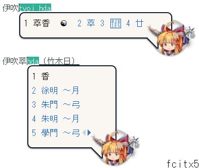

# Fcitx Skin Ibuki Suika
伊吹萃香のFcitxスキン

Note: The icon is pixelated, and SVG format is not preferred.

art drawn by: [@hiohlan](https://github.com/hiohlan)

## fcitx 4

To install the skin only (excluding the Mozc icon), copy the contents of `/fcitx(4)/skin` to `~/.config/fcitx/skin`.

Alternatively, you can copy everything (including the Mozc icon) from `/fcitx(4)` to `/usr/share/fcitx/` (**make sure to BACKUP before doing this**).

## fcitx 5
Only the skin is available; there is no icon.

Copy `/fcitx(5)/themes` to `~/.local/share/fcitx5/themes/` or `/usr/share/fcitx5/themes/`

## todo
- ~~A skin for fcitx 5~~
